# Investigación y despliegue de Hadoop Sandbox con Docker

Práctica LG14 del Grupo 1: análisis y despliegue de Hadoop Sandbox mediante Docker Compose, con una prueba funcional de creación, carga y consulta de archivos en HDFS.

## Contenido

- [Información analizada](#1-información-analizada)
- [Arquitectura](#2-análisis-de-la-arquitectura)
- [Implementación](#3-implementación-práctica)
- [Prueba funcional HDFS](#4-prueba-funcional-hadoophdfs)
- [Comparación con docker-hadoop](#5-comparación-con-docker-hadoop)
- [Conclusiones](#6-conclusiones)
- [Evidencias](#evidencias)
- [Informe completo](#informe-completo)

## Integrantes

- Edson Marcelo Cayo Ali
- Joel Julio Salazar Ferrufino
- Alex Bryam Barrera Alarcon

**Universidad Privada del Valle · Tecnologías Emergentes I · Grupo B · Gestión 2/2026**

**Docente:** Ing. Efrain Luna Mamani.

## Repositorio seleccionado

- **Nombre:** Hadoop Sandbox.
- **Autor/organización:** hadoop-sandbox.
- **URL:** [hadoop-sandbox/hadoop-sandbox](https://github.com/hadoop-sandbox/hadoop-sandbox).
- **Descripción:** clúster Hadoop YARN desplegable con Docker Compose, que integra HDFS, MapReduce, Spark, monitoreo JMX y un nodo cliente.

El archivo [docker-compose.yaml](docker-compose.yaml) corresponde a la configuración utilizada para desplegar el entorno Hadoop Sandbox. Junto con la carpeta [conf/](conf/), proviene del proyecto original y permite reproducir el entorno desde este repositorio. Esta entrega reúne el análisis, la configuración y las evidencias del trabajo realizado.

## 1. Información analizada

### 1.1 Información general


| Dato | Información |
| --- | --- |
| Fecha de creación | 24 de octubre de 2021 |
| Última actualización registrada | 1 de marzo de 2026 |
| Estrellas | 23 |
| Forks | 5 |
| Licencia | No se declara una licencia propia en el repositorio, según el informe |
| Objetivo | Proporcionar un clúster funcional de Apache Hadoop YARN con almacenamiento HDFS, procesamiento distribuido, Spark, monitoreo y acceso mediante un nodo cliente |

### 1.2 Tecnologías

| Tecnología | Versión o uso |
| --- | --- |
| Apache Hadoop | 3.5.0 en el despliegue documentado; incluye HDFS, YARN y MapReduce |
| Docker | Ejecución de los servicios en contenedores |
| Docker Compose | 2.x, para definir y desplegar el entorno |
| Sistema operativo base | Ubuntu Noble 24.04 en las imágenes Hadoop, según el informe |
| Apache Spark | Procesamiento sobre YARN y servicio de historial de aplicaciones |
| Prometheus JMX Exporter | Exportación de métricas de cinco servicios Hadoop |
| Apache HTTP Server | Imagen `httpd:2.4`, utilizada como frontal de las interfaces web |
| OpenSSH | Acceso al nodo cliente |
| Lenguajes y configuración | Shell, YAML y XML; Hadoop y Spark incorporan componentes basados en Java/Scala, cuyo código fuente no forma parte de este repositorio |
| Bases de datos | No se utiliza una base de datos relacional ni NoSQL; el almacenamiento principal es HDFS |

> [!NOTE]
> Las imágenes de Hadoop, Spark y JMX Exporter utilizan la etiqueta `latest`. La versión puede cambiar al descargar imágenes nuevas; las capturas del NameNode y ResourceManager muestran Hadoop **3.5.0** en el entorno de esta práctica.

## 2. Análisis de la arquitectura

### Contenedores e imágenes Docker

El Compose define **13 servicios**: ocho servicios de almacenamiento, procesamiento, historial y acceso, más cinco exportadores JMX. Las imágenes de la siguiente tabla usan el prefijo `ghcr.io/hadoop-sandbox/`, excepto `httpd:2.4`.

| Servicio | Función | Imagen |
| --- | --- | --- |
| `namenode` | Administra los metadatos de HDFS | `hadoop-hdfs-namenode:latest` |
| `datanode` | Almacena los bloques de datos HDFS | `hadoop-hdfs-datanode:latest` |
| `resourcemanager` | Administra recursos y aplicaciones YARN | `hadoop-yarn-resourcemanager:latest` |
| `nodemanager` | Ejecuta las tareas asignadas por YARN | `hadoop-yarn-nodemanager-spark:latest` |
| `jobhistoryserver` | Permite consultar el historial de trabajos MapReduce | `hadoop-mapred-jobhistoryserver:latest` |
| `sparkhistoryserver` | Permite consultar el historial de aplicaciones Spark | `spark-historyserver:latest` |
| `clientnode` | Proporciona herramientas Hadoop/Spark y acceso SSH | `hadoop-client-spark:latest` |
| `front` | Centraliza el acceso a las interfaces mediante Apache HTTPD | `httpd:2.4` |
| `namenode-jmx-exporter` | Exporta métricas del NameNode | `prometheus-jmx-exporter:latest` |
| `datanode-jmx-exporter` | Exporta métricas del DataNode | `prometheus-jmx-exporter:latest` |
| `resourcemanager-jmx-exporter` | Exporta métricas del ResourceManager | `prometheus-jmx-exporter:latest` |
| `nodemanager-jmx-exporter` | Exporta métricas del NodeManager | `prometheus-jmx-exporter:latest` |
| `jobhistoryserver-jmx-exporter` | Exporta métricas del JobHistoryServer | `prometheus-jmx-exporter:latest` |

Compose genera nombres como `hadoop-sandbox-namenode-1` y `hadoop-sandbox-clientnode-1`. El entorno incluye un DataNode y un NodeManager para experimentar localmente con el ecosistema Hadoop.

### Puertos e interfaces

`front` publica las interfaces web hacia el host y reenvía las solicitudes a los servicios internos. `clientnode` publica el puerto SSH. Por defecto, los puertos se enlazan a `127.0.0.1`.

| Servicio o interfaz | Puerto / dirección desde el host |
| --- | --- |
| Página general del clúster | [localhost:8080](http://localhost:8080) |
| HDFS NameNode | [localhost:9870](http://localhost:9870) |
| HDFS DataNode | [localhost:9864](http://localhost:9864) |
| YARN ResourceManager | [localhost:8088](http://localhost:8088) |
| YARN NodeManager | [localhost:8042](http://localhost:8042) |
| MapReduce History Server | [localhost:19888](http://localhost:19888) |
| Spark History Server | [localhost:18080](http://localhost:18080) |
| Explorador WebHDFS | [localhost:9870/explorer.html](http://localhost:9870/explorer.html) |
| SSH del nodo cliente | `2222` del host → `22` del contenedor |

Los exportadores utilizan puertos internos: `1126` (ResourceManager), `1127` (NodeManager), `1128` (NameNode), `1129` (DataNode) y `1130` (JobHistoryServer). No se publican directamente como puertos del host.

### Redes

Se definen las redes `default` y `front`. La primera conecta los componentes internos; `clientnode` y `front` pertenecen a ambas. El NodeManager comparte la red y el espacio IPC del DataNode. Los exportadores también comparten el espacio de red correspondiente mediante `network_mode: service:...`; el del NodeManager utiliza el del DataNode.

### Volúmenes

| Volumen | Uso |
| --- | --- |
| `namenode` | Datos persistentes del NameNode, montados en `/data` |
| `hadoopnode` | Datos del nodo Hadoop, compartidos por DataNode y NodeManager en `/data` |
| `dnsocket` | Socket compartido entre DataNode y NodeManager en `/run/hadoop-hdfs` |
| `clientnodehome` | Directorio `/home/sandbox` del nodo cliente |
| `clientnodessh` | Configuración y claves SSH del nodo cliente en `/etc/ssh` |

Además, se montan archivos de `conf/` en modo de solo lectura para configurar Hadoop, Spark, los exportadores JMX y Apache HTTPD.

### Dependencias entre servicios

Las dependencias utilizan `depends_on` con `condition: service_healthy`, de modo que el inicio espera las comprobaciones de salud de los servicios requeridos.

| Servicio | Servicios que deben estar saludables |
| --- | --- |
| `namenode` | No tiene dependencias declaradas |
| `datanode`, `resourcemanager` | `namenode` |
| `nodemanager` | `namenode`, `datanode`, `resourcemanager` |
| `jobhistoryserver`, `sparkhistoryserver` | `namenode`, `datanode`, `resourcemanager` |
| Cada JMX Exporter | El servicio que supervisa |
| `clientnode` | `namenode`, `datanode`, `resourcemanager`, `nodemanager`, `jobhistoryserver` |
| `front` | Los mismos servicios que `clientnode`, más `sparkhistoryserver` |

### Variables de entorno

Las variables de interpolación pueden definirse en un archivo `.env` junto al Compose para cambiar imágenes y direcciones sin editar la configuración principal.

| Variables | Propósito |
| --- | --- |
| `NAMENODE_IMAGE`, `DATANODE_IMAGE` | Imágenes de los servicios HDFS |
| `RESOURCEMANAGER_IMAGE`, `NODEMANAGER_IMAGE` | Imágenes de los servicios YARN |
| `JOBHISTORYSERVER_IMAGE`, `SPARKHISTORYSERVER_IMAGE` | Imágenes de los servicios de historial |
| `CLIENT_IMAGE` | Imagen del nodo cliente |
| `JMX_EXPORTER_IMAGE` | Imagen utilizada por los cinco exportadores |
| `HTTPD_IMAGE` | Imagen del frontal; por defecto, `httpd:2.4` |
| `LISTEN_ADDRESS` | Dirección de publicación de puertos; por defecto, `127.0.0.1` |
| `LISTEN_HOST` | Nombre de acceso utilizado por el frontal; por defecto, `localhost` |

### Archivos de configuración

- `docker-compose.yaml`: servicios, imágenes, puertos, redes, volúmenes y comprobaciones de salud.
- `conf/hadoop/`: configuración Hadoop, incluidos `core-site.xml`, `hdfs-site.xml`, `capacity-scheduler.xml` y archivos de entorno.
- `conf/spark/`: configuración de Spark.
- `conf/jmx_exporter/`: configuración de métricas para cada servicio supervisado.
- `conf/front/conf/` y `conf/front/htdocs/`: configuración Apache HTTPD y página general del clúster.

La carpeta `conf/` está incluida en esta entrega y contiene las configuraciones del repositorio original utilizadas en el despliegue.

### Diagrama de arquitectura

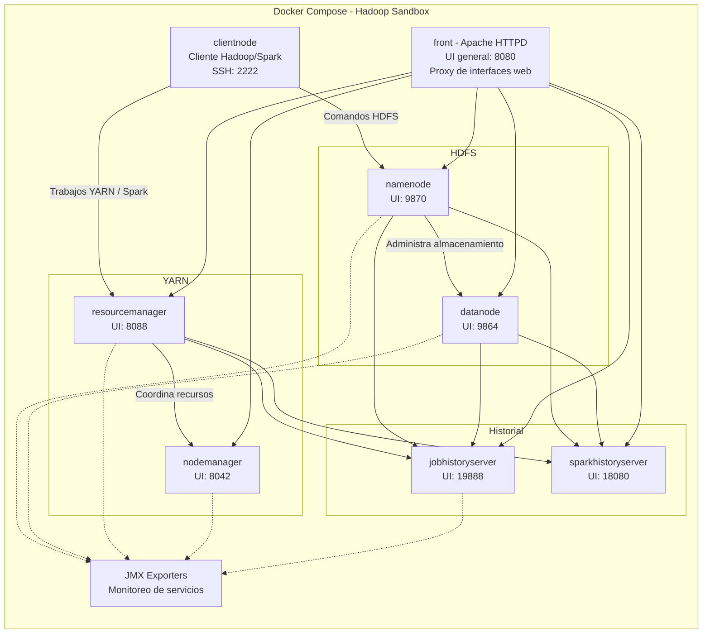

> [!NOTE]
> El bloque **JMX Exporters** agrupa visualmente **cinco contenedores independientes**: uno para NameNode, DataNode, ResourceManager, NodeManager y JobHistoryServer. Sumados a los otros ocho servicios, conforman los **13 servicios totales**. Las interfaces y los puertos indicados coinciden con los documentados por el [proyecto Hadoop Sandbox](https://github.com/hadoop-sandbox/hadoop-sandbox#using-the-cluster); el acceso web desde el host se realiza a través de `front`.

## 3. Implementación práctica

Se utilizó Git, Docker con soporte para contenedores Linux y Docker Compose 2.x. Docker debe estar iniciado y los puertos publicados por el entorno deben estar disponibles.

> [!IMPORTANT]
> Ejecuta los comandos de Docker Compose desde la raíz de este repositorio, donde se encuentran `docker-compose.yaml` y `conf/`. Mantén esa estructura: el Compose utiliza rutas relativas para montar los archivos de configuración.

### Clonación e identificación de archivos

Las evidencias documentan el trabajo realizado sobre el proyecto original. Para reproducirlo con la configuración incluida en esta entrega, ejecuta en PowerShell:

```powershell
git clone https://github.com/Alexby58/bigdata-grupo-1.git
cd bigdata-grupo-1
ls -Force
```

Los archivos principales son `docker-compose.yaml`, `README.md` y la carpeta `conf/`.

### Revisión de Docker Compose

```powershell
cat docker-compose.yaml
more docker-compose.yaml
docker compose config --services
```

`cat` y `more` permiten revisar la configuración; el último comando enumera los **13 servicios** definidos.

### Inicio y verificación del clúster

```powershell
docker compose up -d
docker ps
```

### Acceso al nodo cliente

Desde la carpeta del proyecto desplegado:

```powershell
docker compose exec -u sandbox clientnode bash
```

Este comando abre una sesión Bash como usuario `sandbox`. Las operaciones HDFS de la siguiente sección se ejecutan dentro de esa sesión.

## 4. Prueba funcional Hadoop/HDFS

La prueba verifica que el clúster permita crear un directorio, almacenar un archivo y recuperar su contenido mediante HDFS.

### Creación del directorio

```bash
hdfs dfs -mkdir -p /user/sandbox/prueba_hdfs
hdfs dfs -ls /user/sandbox
```

El listado muestra el directorio `prueba_hdfs` dentro del espacio del usuario `sandbox`.

### Creación y carga del archivo

Primero se crea el archivo en el sistema local del contenedor cliente y después se carga a HDFS:

```bash
echo "Prueba funcional de Hadoop HDFS - Hadoop Sandbox" > /tmp/prueba.txt
cat /tmp/prueba.txt
hdfs dfs -put /tmp/prueba.txt /user/sandbox/prueba_hdfs/
hdfs dfs -ls /user/sandbox/prueba_hdfs
```

El archivo local `/tmp/prueba.txt` y el archivo HDFS `/user/sandbox/prueba_hdfs/prueba.txt` pertenecen a sistemas de archivos distintos. El comando `-put` realiza la carga al almacenamiento HDFS.

### Consulta del archivo almacenado

```bash
hdfs dfs -cat /user/sandbox/prueba_hdfs/prueba.txt
```

Resultado obtenido:

```text
Prueba funcional de Hadoop HDFS - Hadoop Sandbox
```

### Verificación desde WebHDFS

Abrir el [explorador de HDFS](http://localhost:9870/explorer.html) y navegar a `/user/sandbox/prueba_hdfs`.

### Resultados

| Operación | Resultado documentado |
| --- | --- |
| Creación del directorio | `/user/sandbox/prueba_hdfs` aparece en el listado |
| Carga del archivo | `prueba.txt` aparece dentro del directorio HDFS |
| Consulta del contenido | La salida coincide con el texto cargado |
| Verificación web | El explorador muestra el archivo, su bloque y su contenido |

La prueba de almacenamiento HDFS fue exitosa. Las [evidencias 10 a 13](#10-creación-del-directorio-hdfs) documentan estas operaciones. El despliegue también incorpora MapReduce y Spark, pero esta prueba funcional se centró en HDFS.

> [!TIP]
> Si repites la carga y `prueba.txt` ya existe en HDFS, utiliza otro nombre o añade `-f` a `hdfs dfs -put` únicamente si deseas reemplazar el archivo de prueba existente.

## 5. Comparación con docker-hadoop

Comparación del proyecto analizado con [Big Data Europe – docker-hadoop](https://github.com/big-data-europe/docker-hadoop), tomando como referencia sus configuraciones principales.

| Característica | docker-hadoop | Hadoop Sandbox |
| --- | --- | --- |
| Tecnología principal | Apache Hadoop | Apache Hadoop |
| Versión Hadoop analizada | 3.2.1 en sus imágenes principales | 3.5.0 en el despliegue documentado |
| Docker | Sí | Sí |
| Docker Compose | Sí | Sí, 2.x |
| Número de contenedores | 5: NameNode, DataNode, ResourceManager, NodeManager e HistoryServer | 13: servicios Hadoop, Spark, cliente, frontal y cinco exportadores JMX |
| Almacenamiento distribuido | HDFS | HDFS |
| Procesamiento distribuido | YARN + MapReduce | YARN + MapReduce + Spark |
| Interfaces web | NameNode, DataNode, ResourceManager, NodeManager e HistoryServer | Interfaces Hadoop, MapReduce History Server, Spark History Server, página general y acceso documentado al explorador WebHDFS |
| Persistencia | 3 volúmenes principales | 5 volúmenes |
| Complejidad de instalación | Baja-media; menos servicios | Media; más componentes coordinados por Compose |
| Documentación | Orientada al despliegue Hadoop y una prueba WordCount | Incluye acceso SSH, pruebas MapReduce/Spark, WebHDFS y configuración |
| Caso de uso | Crear un clúster Hadoop básico en Docker | Experimentar con Hadoop y servicios adicionales de procesamiento, monitoreo y acceso |

Hadoop Sandbox amplía el entorno con Spark, exportadores JMX, un nodo cliente y un frontal HTTP. La comparación permite identificar diferencias de alcance y arquitectura, sin establecer que uno de los proyectos sea mejor. WebHDFS es una funcionalidad de HDFS; su mención explícita en la documentación de Sandbox no implica que sea exclusiva de este proyecto.

## 6. Conclusiones

La práctica permitió comprender la función de los componentes de HDFS, YARN, MapReduce y Spark dentro de un entorno desplegado con Docker Compose. La separación en servicios y las dependencias de salud facilitaron el análisis de su organización y arranque.

Las evidencias documentan los contenedores activos y el acceso a las interfaces del clúster. La prueba HDFS confirmó la creación de un directorio, la carga de un archivo y la recuperación de su contenido, con una comprobación adicional desde el explorador web.

La comparación con docker-hadoop mostró que Hadoop Sandbox incorpora más servicios de procesamiento, monitoreo y acceso. El trabajo cubrió las etapas de encontrar, comprender, desplegar, probar y analizar un repositorio Big Data real basado en contenedores.

## Evidencias

Las siguientes capturas corresponden al despliegue y a la prueba realizados sobre el repositorio original `hadoop-sandbox`.

### 1. Clonación del repositorio original

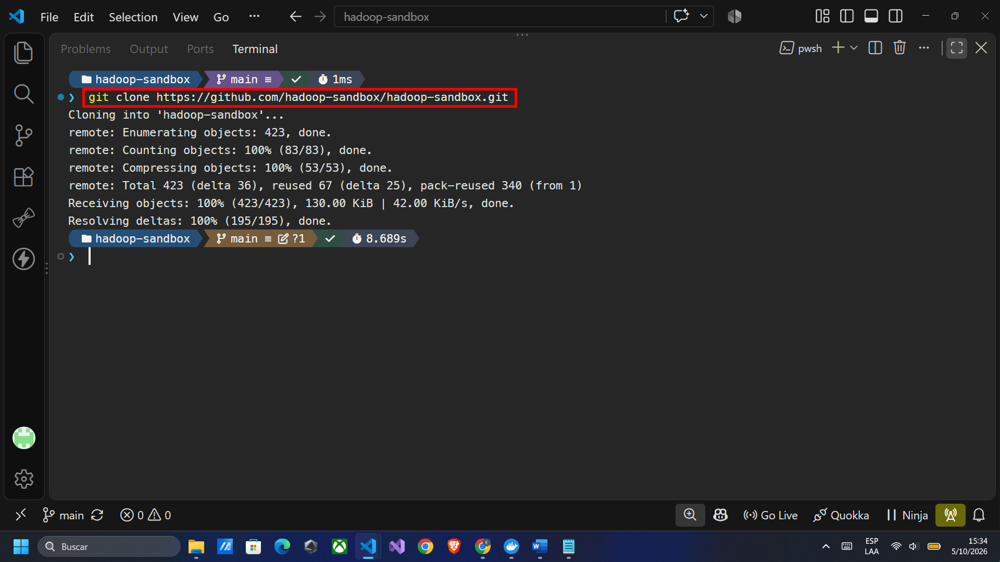

### 2. Identificación de archivos principales

El listado con `ls -Force` permite identificar `conf/`, `docker-compose.yaml` y `README.md` en la carpeta de trabajo del proyecto original.

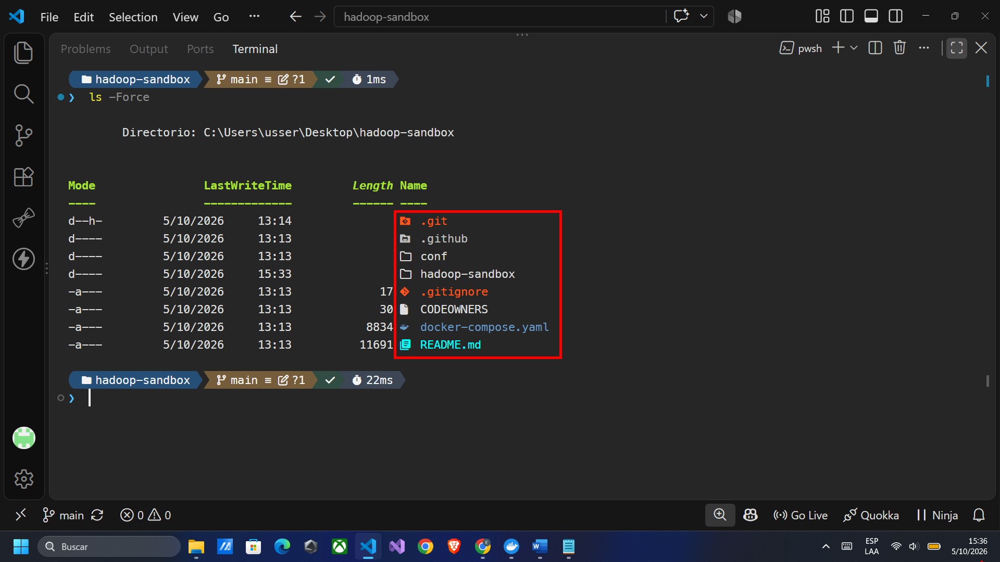

### 3. Revisión de Docker Compose

La consulta con `more docker-compose.yaml` muestra la definición del NameNode, su imagen, volúmenes y comprobación de salud, seguida del exportador JMX.

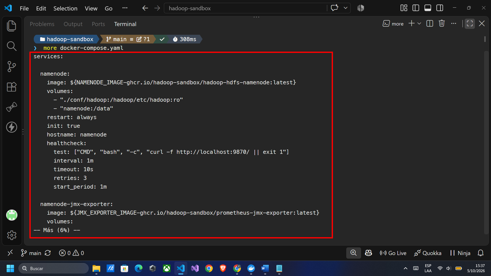

### 4. Servicios definidos en Compose

El comando `docker compose config --services` enumera los 13 servicios del despliegue.

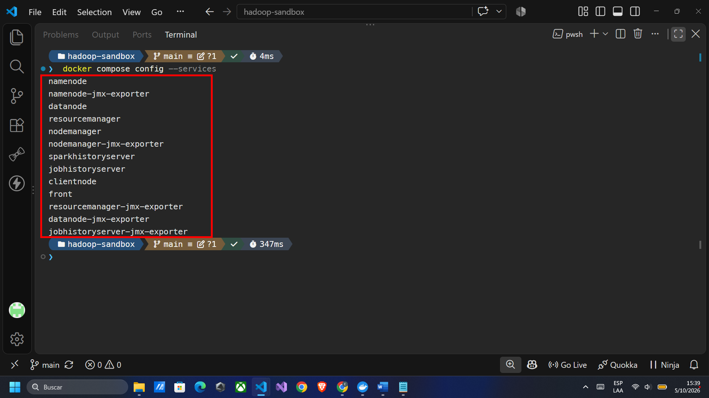

### 5. Inicio del clúster

La ejecución de `docker compose up -d` muestra `Running 13/13`, con los servicios iniciados y las dependencias principales saludables.

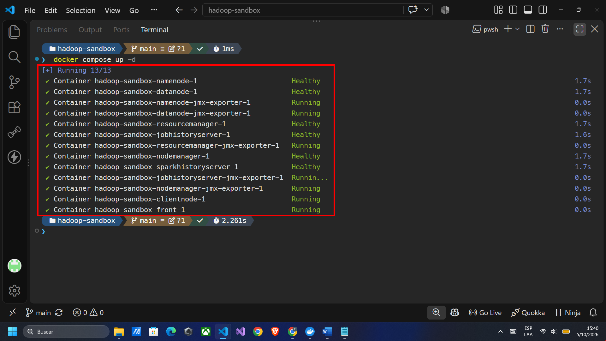

### 6. Contenedores activos

`docker ps` muestra los contenedores en estado `Up` y `healthy`, las imágenes utilizadas y los puertos publicados por `front` y `clientnode`.

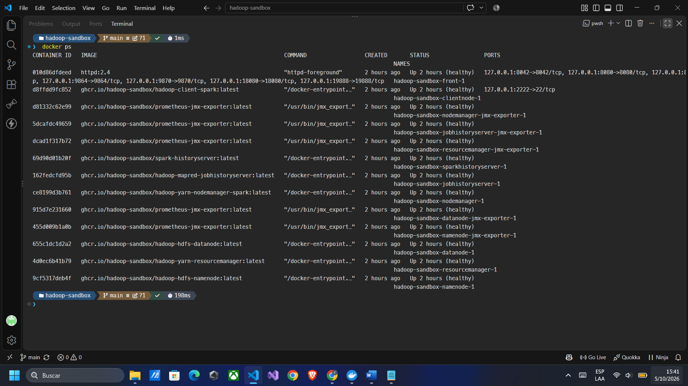

### 7. Página general del clúster

En `localhost:8080` se encuentran los enlaces a las interfaces de los servicios y a las métricas de los cinco componentes supervisados.

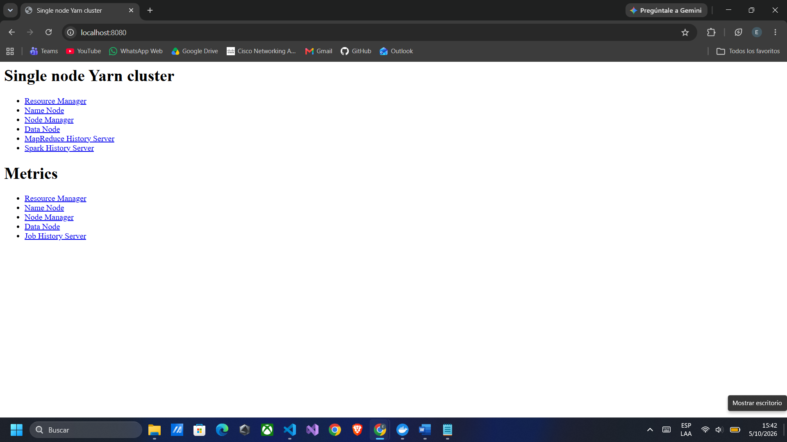

### 8. Interfaz del NameNode

La página de HDFS muestra el NameNode activo, la versión Hadoop 3.5.0 y el estado general del sistema de archivos antes de cargar el archivo de prueba.

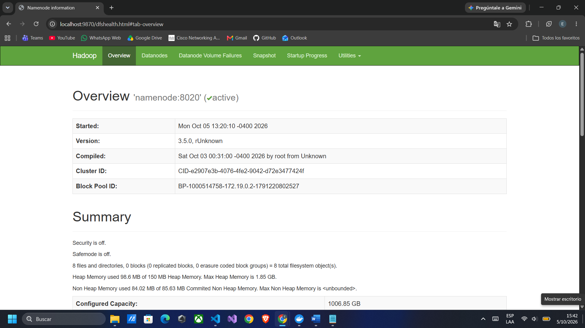

### 9. Interfaz del ResourceManager

YARN muestra un nodo activo y recursos totales de 8 GB de memoria y 8 vCores.

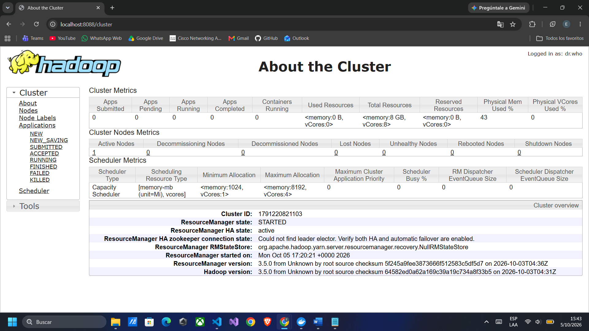

### 10. Creación del directorio HDFS

La ejecución de `hdfs dfs -mkdir -p` y el listado posterior confirman la creación de `/user/sandbox/prueba_hdfs`.

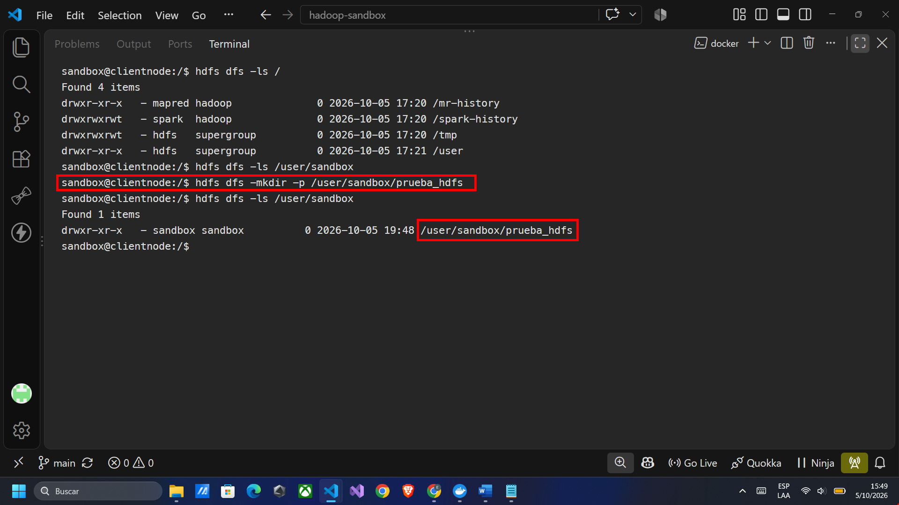

### 11. Carga del archivo a HDFS

Se crea y consulta el archivo local, se carga mediante `hdfs dfs -put` y se comprueba su presencia en el directorio HDFS. El listado muestra `prueba.txt` con un tamaño de 49 bytes.

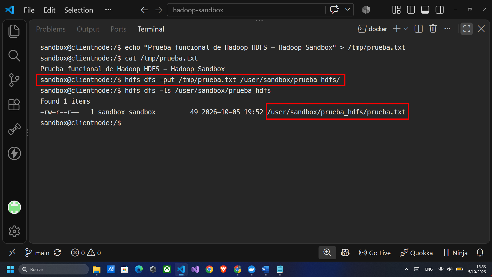

### 12. Consulta del archivo almacenado

`hdfs dfs -cat` recupera desde HDFS el mismo texto que se escribió en el archivo de prueba.

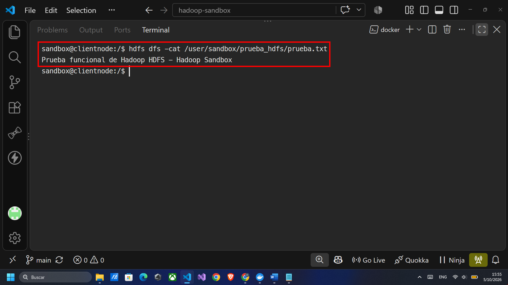

### 13. Verificación del archivo desde WebHDFS

El explorador muestra `/user/sandbox/prueba_hdfs/prueba.txt`, su tamaño de 49 bytes, replicación 1 y el bloque disponible en `hadoopnode`. El panel de contenido permite comprobar visualmente el texto almacenado.

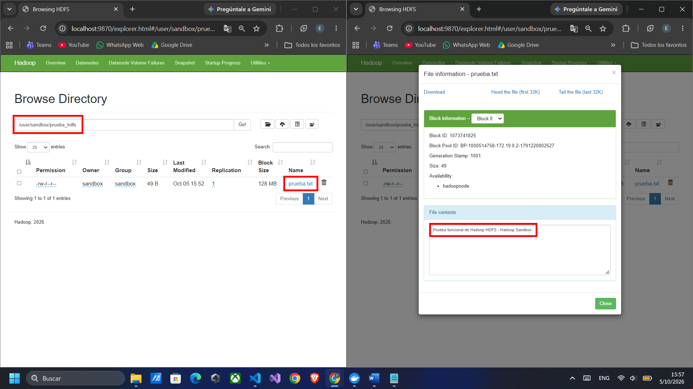

## Informe completo

[Ver informe completo en PDF](<docs/LG14 – REPOSITORIO BIG DATA CON DOCKER.pdf>)
